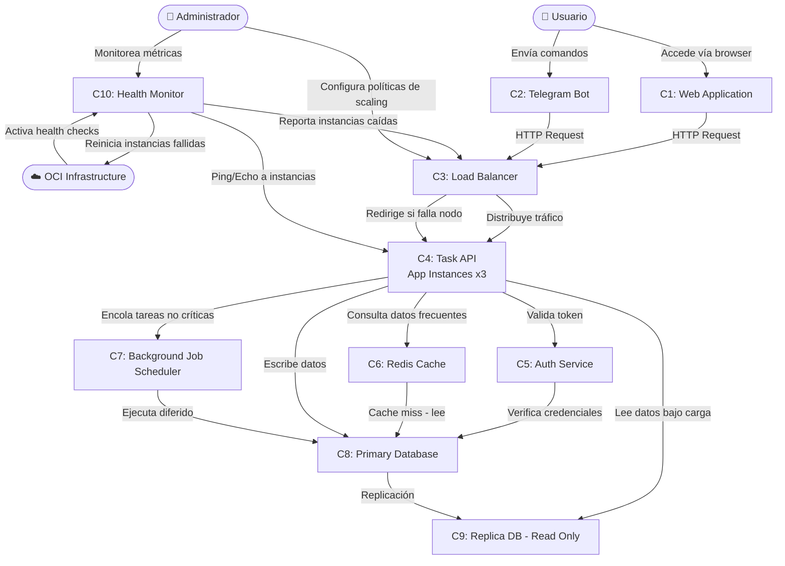
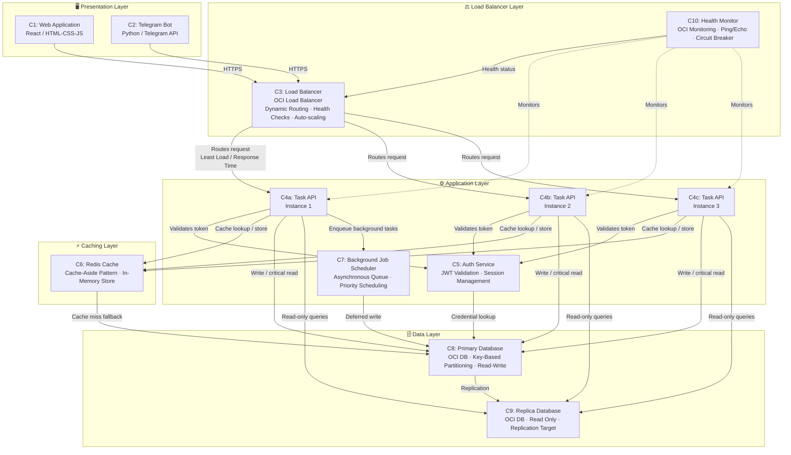
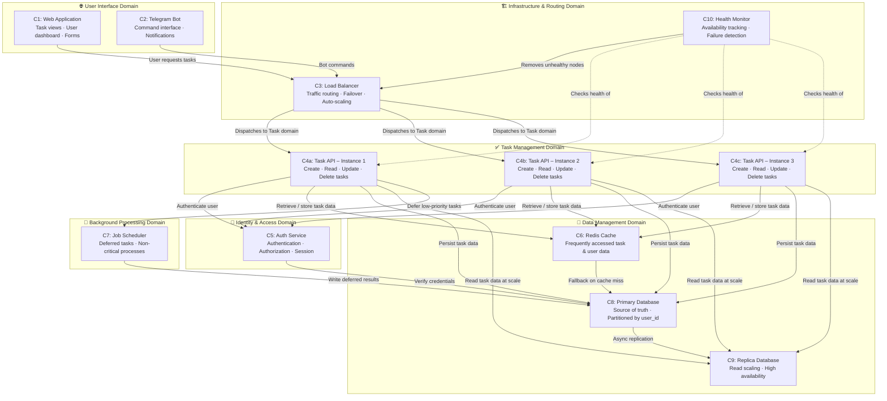

# Component-Based Thinking
**Planeación de Sistemas de Software (Gpo 104)** 
Gustavo García Téllez · Juan Pablo Torres · María Guadalupe Soto Acosta · Juan Pablo Gil

---

## 1. Component Identification process and Rationale

### Methodology: Actions/Actors Approach

Nosotros elegimos la metodología Actors/Actions Approach, debido a que identificamos que nuestro sistema de gestión de tareas cuenta con distintos actores, como usuarios, bots e infraestructura en OCI, entre otros. Este método nos permite organizar las funciones de cada elemento, facilitando la identificación de las responsabilidades de cada componente sin ambigüedades.

El proceso siguió estos pasos:

1. **Identificar actores** – primero identificamos todos los elementos que interactúan con el sistema, como el usuario final, el bot de Telegram, el administrador y algunos componentes de infraestructura en OCI, por ejemplo el Load Balancer y el OCI Scheduler.  

2. **Mapear acciones** – después analizamos qué acciones realiza cada actor y cuáles recibe dentro del sistema, para entender mejor cómo se comunican entre sí.  

3. **Agrupar acciones por responsabilidad** – una vez identificadas las acciones, agrupamos las que estaban relacionadas para formar componentes más organizados y fáciles de mantener, procurando que cada uno tuviera una responsabilidad clara.  

4. **Validar con los Quality Attributes** – finalmente verificamos que cada componente ayudara a cumplir con los ASR definidos en el Sprint 0, especialmente en aspectos como rendimiento, disponibilidad y escalabilidad.

Los componentes resultantes son:

| ID | Componente |
|----|-----------|
| C1 | Web Application (Frontend) |
| C2 | Telegram Bot |
| C3 | Load Balancer (OCI) |
| C4 | Task API (App Instances) |
| C5 | Auth Service |
| C6 | Redis Cache |
| C7 | Background Job Scheduler |
| C8 | Primary Database (OCI DB) |
| C9 | Replica Database (OCI DB Read) |
| C10 | Health Monitor |

---
## 2. Flow Diagram – Actions/Actors Approach

---

## 3. Component Table

| Actor | Event / Action | Componente | Responsabilidades del Componente |
|---|---|---|---|
| Usuario | Accede a la aplicación vía browser | C1: Web Application | Renderizar la interfaz de usuario; enviar peticiones HTTP al Load Balancer; mostrar listas de tareas, estados y notificaciones |
| Usuario | Envía comandos de tareas por Telegram | C2: Telegram Bot | Recibir mensajes de Telegram; traducir comandos a llamadas HTTP; retornar respuestas formateadas al usuario |
| Load Balancer | Recibe tráfico de C1 y C2 | C3: Load Balancer (OCI) | Distribuir tráfico a la instancia con menor carga; redirigir tráfico ante fallo de nodo; ejecutar health checks periódicos; aplicar auto-scaling según CPU > 70% |
| OCI Infrastructure | Detecta alta carga (CPU > 70%) | C3: Load Balancer (OCI) | Activar políticas de escalado horizontal; lanzar o terminar instancias según demanda |
| Task API | Recibe petición de usuario | C5: Auth Service | Validar tokens de autenticación; gestionar sesiones; verificar permisos de acceso a recursos |
| Task API | Consulta o modifica tareas | C4: Task API (App Instances) | Manejar CRUD de tareas; coordinar acceso a Cache y Base de Datos; encolar trabajos en background bajo alta carga; responder en < 1.5s bajo carga normal, < 3s bajo carga pico |
| Task API | Lee datos frecuentemente consultados | C6: Redis Cache | Almacenar en memoria datos de usuarios y tareas frecuentes; aplicar patrón Cache-Aside; retornar respuestas en < 1s para datos cacheados |
| Task API | Escribe o lee datos persistentes | C8: Primary Database (OCI) | Persistir todos los datos de tareas y usuarios; aplicar particionamiento por user_id; procesar escrituras y lecturas críticas; replicar datos a la réplica |
| Task API | Lee datos bajo carga alta | C9: Replica Database (OCI) | Atender consultas de solo lectura; reducir carga en el Primary DB; mantenerse sincronizada vía replicación |
| Task API | Recibe tarea no crítica en alta carga | C7: Background Job Scheduler | Recibir y encolar tareas no críticas (e.g., notificaciones, reportes); posponer ejecución hasta que carga del sistema sea < 60%; ejecutar procesos diferidos de forma asíncrona |
| OCI Infrastructure | Envía ping periódico a instancias | C10: Health Monitor | Ejecutar health checks cada N segundos; marcar instancias como unhealthy tras 3 fallos consecutivos; notificar al Load Balancer para excluir nodos; solicitar reinicio automático de instancias caídas |
| Administrador | Monitorea el estado del sistema | C10: Health Monitor | Exponer métricas de salud, latencia y uso de recursos; generar alertas ante anomalías |

---

## 4. Technical Partitioning

> Organizado por **capas técnicas**: Presentation, Load Balancing, Application, Caching y Data. Refleja cómo la tecnología está distribuida en la infraestructura.

---

## 5. Domain Partitioning

> Organizado por **dominios de negocio**: User Interface, Infrastructure, Task Management, Identity & Access, Data Management y Background Processing. Refleja cómo las responsabilidades funcionales están agrupadas.

