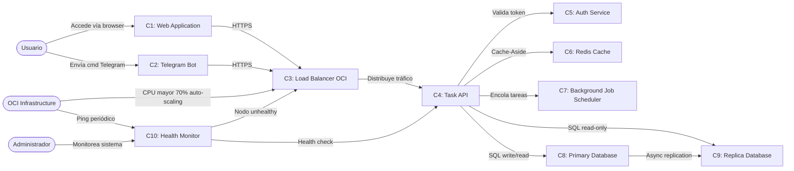
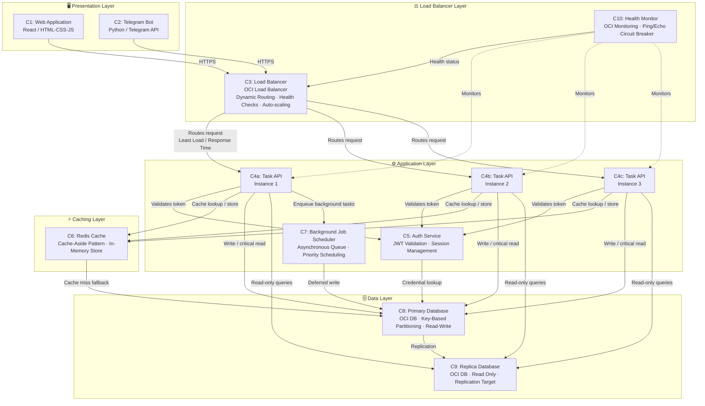
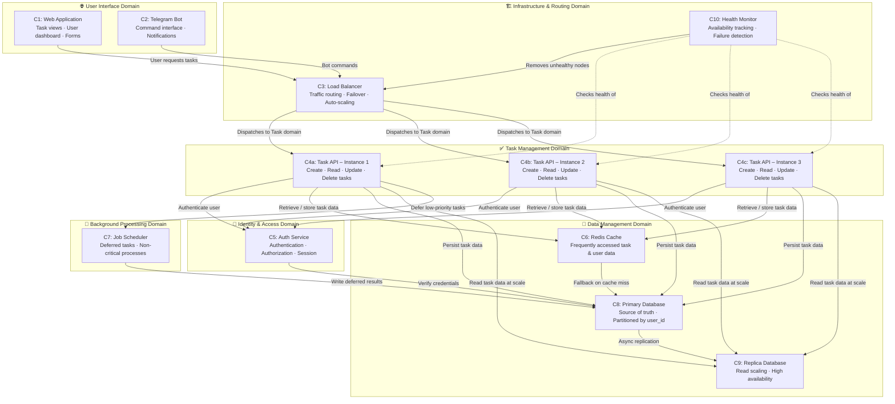

# Component-Based Thinking
**Planeación de Sistemas de Software (Gpo 104)** 
Gustavo García Téllez · Juan Pablo Torres · María Guadalupe Soto Acosta · Juan Pablo Gil

---

## 1. Component Identification process and Rationale

### Methodology: Actions/Actors Approach

Nosotros elegimos la metodología Actors/Actions Approach, debido a que identificamos que nuestro sistema de gestión de tareas cuenta con distintos actores, como usuarios, bots e infraestructura en OCI, entre otros. Este método nos permite organizar las funciones de cada elemento, facilitando la identificación de las responsabilidades de cada componente sin ambigüedades.

El proceso siguió estos pasos:

1. **Identificar actores** – primero identificamos todos los elementos que interactúan con el sistema, como el usuario final, el bot de Telegram, el administrador y algunos componentes de infraestructura en OCI, por ejemplo el Load Balancer y el OCI Scheduler.  

2. **Mapear acciones** – después analizamos qué acciones realiza cada actor y cuáles recibe dentro del sistema, para entender mejor cómo se comunican entre sí.  

3. **Agrupar acciones por responsabilidad** – una vez identificadas las acciones, agrupamos las que estaban relacionadas para formar componentes más organizados y fáciles de mantener, procurando que cada uno tuviera una responsabilidad clara.  

4. **Validar con los Quality Attributes** – finalmente verificamos que cada componente ayudara a cumplir con los ASR definidos en el Sprint 0, especialmente en aspectos como rendimiento, disponibilidad y escalabilidad.

Los componentes resultantes son:

| ID | Componente |
|----|-----------|
| C1 | Web Application (Frontend) |
| C2 | Telegram Bot |
| C3 | Load Balancer (OCI) |
| C4 | Task API (App Instances) |
| C5 | Auth Service |
| C6 | Redis Cache |
| C7 | Background Job Scheduler |
| C8 | Primary Database (OCI DB) |
| C9 | Replica Database (OCI DB Read) |
| C10 | Health Monitor |

---
## 2. Flow Diagram – Actions/Actors Approach

---

## 3. Component Table

| Actor | Event / Action | Componente | Responsabilidades del Componente |
|---|---|---|---|
| Usuario | Ingresa a la aplicación desde el navegador | C1: Web Application | Mostrar la interfaz al usuario, permitir la visualización de tareas y enviar las solicitudes necesarias al sistema para consultar o actualizar información. |
| Usuario | Gestiona tareas mediante comandos en Telegram | C2: Telegram Bot | Recibir los mensajes enviados por el usuario, interpretar los comandos y devolver respuestas claras y organizadas dentro de Telegram. |
| Load Balancer | Gestiona las solicitudes entrantes del sistema | C3: Load Balancer (OCI) | Distribuir el tráfico entre las instancias disponibles, detectar fallos en los nodos y redirigir las solicitudes para mantener la disponibilidad del sistema. |
| OCI Infrastructure | Detecta incrementos en el uso de recursos | C3: Load Balancer (OCI) | Ajustar automáticamente la cantidad de instancias activas según la demanda del sistema para mantener un rendimiento estable. |
| Task API | Verifica la autenticidad de los usuarios | C5: Auth Service | Validar usuarios y sesiones activas, así como controlar que cada usuario tenga permisos para acceder a determinados recursos. |
| Task API | Procesa operaciones relacionadas con tareas | C4: Task API (App Instances) | Gestionar la creación, consulta, actualización y eliminación de tareas, además de coordinar la comunicación con la caché y la base de datos. |
| Task API | Solicita información de acceso frecuente | C6: Redis Cache | Guardar temporalmente información consultada con frecuencia para acelerar las respuestas y reducir la carga de la base de datos. |
| Task API | Guarda y recupera información persistente | C8: Primary Database (OCI) | Almacenar de forma segura la información principal del sistema, incluyendo usuarios y tareas, asegurando la integridad de los datos. |
| Task API | Realiza consultas de solo lectura | C9: Replica Database (OCI) | Atender consultas de lectura para disminuir la carga de la base de datos principal y mejorar el rendimiento general. |
| Task API | Envía procesos secundarios para ejecución diferida | C7: Background Job Scheduler | Administrar tareas que no requieren ejecución inmediata, como notificaciones o reportes, procesándolas de manera asíncrona. |
| OCI Infrastructure | Supervisa constantemente el estado de las instancias | C10: Health Monitor | Monitorear la salud de las instancias, detectar fallos y notificar al sistema para reemplazar o reiniciar servicios cuando sea necesario. |
| Administrador | Consulta el estado general de la plataforma | C10: Health Monitor | Proporcionar métricas y alertas relacionadas con el rendimiento, disponibilidad y uso de recursos del sistema. |
---

## 4. Technical Partitioning

> Organizado por **capas técnicas**: Presentation, Load Balancing, Application, Caching y Data. Refleja cómo la tecnología está distribuida en la infraestructura.

---

## 5. Domain Partitioning

> Organizado por **dominios de negocio**: User Interface, Infrastructure, Task Management, Identity & Access, Data Management y Background Processing. Refleja cómo las responsabilidades funcionales están agrupadas.

